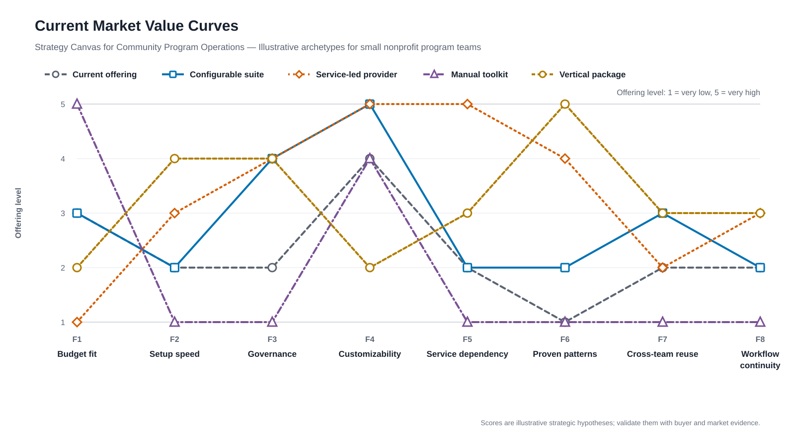
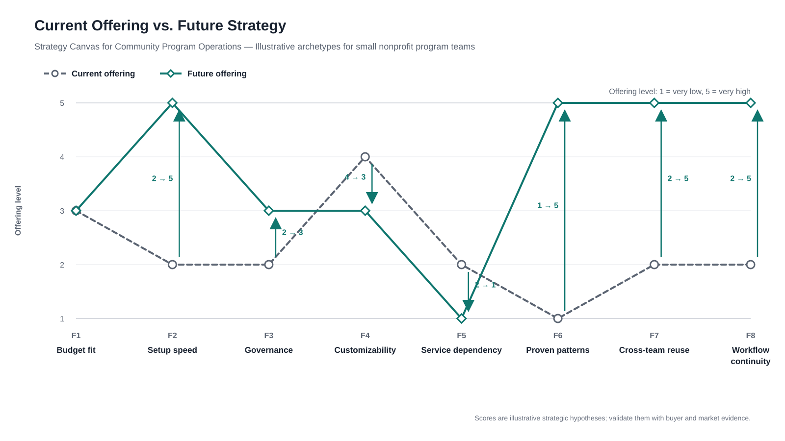

# Strategy Canvas for Community Program Operations

> **tl;dr:** The illustrative market either maximizes flexibility, supplies expert help, or leaves teams with inexpensive manual work. The future strategy deliberately reduces blank-canvas customization and service dependency while creating faster setup from proven program patterns that remain reusable across teams.

This example uses fictional comparator archetypes and illustrative scores. It demonstrates structure, not market research. A real canvas must replace these assumptions with cited evidence.

## Competitive Factors

| ID | Factor | Why it matters |
|:-|:-|:-|
| F1 | Budget fit | Small program teams need predictable costs that fit constrained operating budgets. |
| F2 | Setup speed | Teams need to move from a new program idea to a working operating process quickly. |
| F3 | Governance | Program leaders need enough oversight to protect participant data and shared processes. |
| F4 | Customizability | Teams often adapt intake, delivery, and reporting to local program needs. |
| F5 | Expert-service dependency | Reliance on external experts adds cost and can slow routine changes. |
| F6 | Proven program patterns | Reusable operating patterns reduce uncertainty and blank-canvas design work. |
| F7 | Reuse across teams | Shared patterns make it easier to expand a successful program. |
| F8 | Workflow continuity | Teams benefit when intake, delivery, follow-up, and reporting stay connected. |

## Comparator Selection

| Comparator | Buyer alternative | Why plotted | Confidence |
|:-|:-|:-|:-|
| Configurable suite | Assemble a process in a general-purpose platform | Represents maximum configuration with limited program guidance. | Low |
| Service-led provider | Hire specialists to design and operate the process | Represents a high-touch path that trades budget and autonomy for expertise. | Low |
| Manual toolkit | Coordinate work through documents and spreadsheets | Represents the inexpensive status quo and its fragmentation costs. | Low |
| Vertical package | Adopt a predefined program-specific system | Represents stronger defaults with less freedom to change the operating model. | Low |

Supporting alternatives: internally built tools are represented by the configurable-suite curve because both emphasize control and customization. Individual documents and spreadsheet templates are represented by the manual-toolkit curve. Validate those groupings with target buyers before using them in a decision.

## Competitor Dossiers

### Configurable suite

- **Buyer alternative:** Build a tailored process in a broad platform already available to the organization.
- **Category:** General-purpose substitute.
- **Why included:** It reveals the tradeoff between maximum flexibility and fast, guided adoption.
- **Defining strengths:** Illustratively high governance and customizability.
- **Defining weaknesses:** Hypothesized setup burden and limited program-specific guidance.
- **Pivotal score rationale:** The `5` for customizability and `2` for setup speed create its defining curve.
- **Evidence:** Illustrative archetype only; replace with product documentation and buyer evidence.
- **Confidence:** Low, because the scores are unvalidated assumptions.

### Service-led provider

- **Buyer alternative:** Pay an expert to design or operate the program workflow.
- **Category:** Service-led substitute.
- **Why included:** It represents buyers who value guidance more than self-service or budget fit.
- **Defining strengths:** Illustratively high expertise, governance, and customization.
- **Defining weaknesses:** Hypothesized cost and dependence on outside help.
- **Pivotal score rationale:** The `5` for service dependency and `1` for budget fit distinguish this alternative.
- **Evidence:** Illustrative archetype only; replace with scoped proposals, service descriptions, and buyer evidence.
- **Confidence:** Low, because provider models vary widely.

### Manual toolkit

- **Buyer alternative:** Coordinate work with documents, spreadsheets, email, and personal knowledge.
- **Category:** Status quo.
- **Why included:** It is often the real alternative when a team cannot justify a new system.
- **Defining strengths:** Illustratively strong budget fit and local flexibility.
- **Defining weaknesses:** Hypothesized fragmentation, slow setup, and limited reuse.
- **Pivotal score rationale:** The `5` for budget fit and `1` scores for continuity and reuse show why cheap is not automatically better.
- **Evidence:** Illustrative archetype only; replace with observation of current workflows.
- **Confidence:** Low until validated with target teams.

### Vertical package

- **Buyer alternative:** Adopt a predefined system designed for one program model.
- **Category:** Direct or adjacent alternative.
- **Why included:** It reveals the tradeoff between strong defaults and adaptable workflows.
- **Defining strengths:** Illustratively fast setup, governance, and proven patterns.
- **Defining weaknesses:** Hypothesized limits on customization and cross-team reuse.
- **Pivotal score rationale:** The `5` for proven patterns and `2` for customizability define the curve.
- **Evidence:** Illustrative archetype only; replace with current product documentation and buyer evidence.
- **Confidence:** Low, because no named product or segment has been researched.

## Strategy Canvas

| ID | Factor | Current | Future | Configurable suite | Service-led provider | Manual toolkit | Vertical package |
|:-|:-|:-:|:-:|:-:|:-:|:-:|:-:|
| F1 | Budget fit | 3 | 3 | 3 | 1 | 5 | 2 |
| F2 | Setup speed | 2 | 5 | 2 | 3 | 1 | 4 |
| F3 | Governance | 2 | 3 | 4 | 4 | 1 | 4 |
| F4 | Customizability | 4 | 3 | 5 | 5 | 4 | 2 |
| F5 | Expert-service dependency | 2 | 1 | 2 | 5 | 1 | 3 |
| F6 | Proven program patterns | 1 | 5 | 2 | 4 | 1 | 5 |
| F7 | Reuse across teams | 2 | 5 | 3 | 2 | 1 | 3 |
| F8 | Workflow continuity | 2 | 5 | 2 | 3 | 1 | 3 |

Pivotal score notes:

1. **Setup speed becomes a defining future advantage.** The future score assumes teams can start from a complete program pattern rather than a blank configuration surface.
2. **Customization is deliberately reduced.** The future curve trades maximum flexibility for clearer defaults and faster adoption.
3. **All comparator scores remain provisional.** The archetypes help structure discovery but cannot replace named alternatives and buyer evidence.

The visual charts and ASCII charts below demonstrate alternative delivery paths. In a real response, use the visual charts when the agent can create and display them accurately; otherwise use the ASCII fallback. Do not return both unless the user asks for both.

### Current Market Value Curves



### Current vs. Future



### ASCII Fallback When Images Cannot Be Displayed

Use one plainly titled solid-line chart per series. Stack the crowded market panels and place current and future side by side; do not encode identity through marker legends or dotted lines. A standalone copy of this example is [strategy-canvas-ascii.txt](strategy-canvas-ascii.txt).

```text
CURRENT MARKET VALUE CURVES

CURRENT OFFERING
5 |
  |
4 |                  o
  |                // \\
3 |o\             /     \
  |  \\\        //       \\
2 |     \o-----o           o\         /o-----o
  |                          \\\   ///
1 |                             \o/
  +-------------------------------------------
   F1    F2    F3    F4    F5    F6    F7    F8

CONFIGURABLE SUITE
5 |                 /o
  |              ///  \
4 |            o/      \
  |          //         \
3 |o\       /            \            /o\
  |  \\\  //              \        ///   \\\
2 |     \o                 o-----o/         \o
  |
1 |
  +-------------------------------------------
   F1    F2    F3    F4    F5    F6    F7    F8

SERVICE-LED PROVIDER
5 |                 /o-----o\
  |              ///         \\\
4 |           /o/               \o
  |        ///                    \\
3 |      o/                         \       /o
  |    //                            \\  ///
2 |   /                                o/
  | //
1 |o
  +-------------------------------------------
   F1    F2    F3    F4    F5    F6    F7    F8

MANUAL TOOLKIT
5 |o
  | \
4 |                  o
  |  \              / \
3 |   \            /   \
  |    \          /     \
2 |              /       \
  |     \       /         \
1 |      o-----o           o-----o-----o-----o
  +-------------------------------------------
   F1    F2    F3    F4    F5    F6    F7    F8

VERTICAL PACKAGE
5 |                              o
  |                            // \\
4 |      o-----o              /     \
  |    //       \\          //       \\
3 |   /           \       /o           o-----o
  | //             \\  ///
2 |o                 o/
  |
1 |
  +-------------------------------------------
   F1    F2    F3    F4    F5    F6    F7    F8

CURRENT VS. FUTURE STRATEGY

CURRENT OFFERING                                  FUTURE OFFERING
5 |                                               5 |      o                       o-----o-----o
  |                                                 |    // \\                    /
4 |                  o                            4 |   /     \
  |                // \\                            | //       \\                /
3 |o\             /     \                         3 |o           o-----o        /
  |  \\\        //       \\                         |                   \\     /
2 |     \o-----o           o\         /o-----o    2 |                     \
  |                          \\\   ///              |                      \\ /
1 |                             \o/               1 |                        o
  +-------------------------------------------      +-------------------------------------------
   F1    F2    F3    F4    F5    F6    F7    F8      F1    F2    F3    F4    F5    F6    F7    F8

FACTOR KEY
F1 Budget fit
F2 Setup speed
F3 Governance
F4 Customizability
F5 Expert-service dependency
F6 Proven program patterns
F7 Reuse across teams
F8 Workflow continuity
```

## What The Curves Show

1. **The future curve rejects the market's main tradeoff.** It aims to combine the vertical package's fast starting point with more workflow continuity and reuse.
2. **The strategy does not maximize every factor.** Customizability falls, governance remains sufficient rather than maximal, and expert-service dependency decreases.
3. **The value leap depends on reusable patterns.** Setup speed, proven patterns, reuse, and continuity must reinforce one another rather than become isolated features.
4. **The manual status quo remains dangerous on budget fit.** A new offering must show enough time or outcome value to justify moving away from familiar low-cost tools.

## ERRC Moves

| Eliminate | Reduce | Raise | Create |
|:-|:-|:-|:-|
| Blank-canvas setup as the default | Advanced customization before first value | Setup speed and workflow continuity | Reusable end-to-end program patterns |
| Expert help for routine changes | Governance beyond the target segment's needs | Cross-team reuse and clear guidance | Signals showing pattern purpose, owner, and maturity |

## Evidence Gaps and Open Questions

1. Which named products, services, and manual processes are real alternatives for the target buyer?
2. Do program teams value reusable patterns enough to accept less initial customization?
3. Which governance requirements are mandatory, and which reflect larger organizations outside the target segment?
4. What evidence would demonstrate that connected workflows improve time, cost, or program outcomes?
